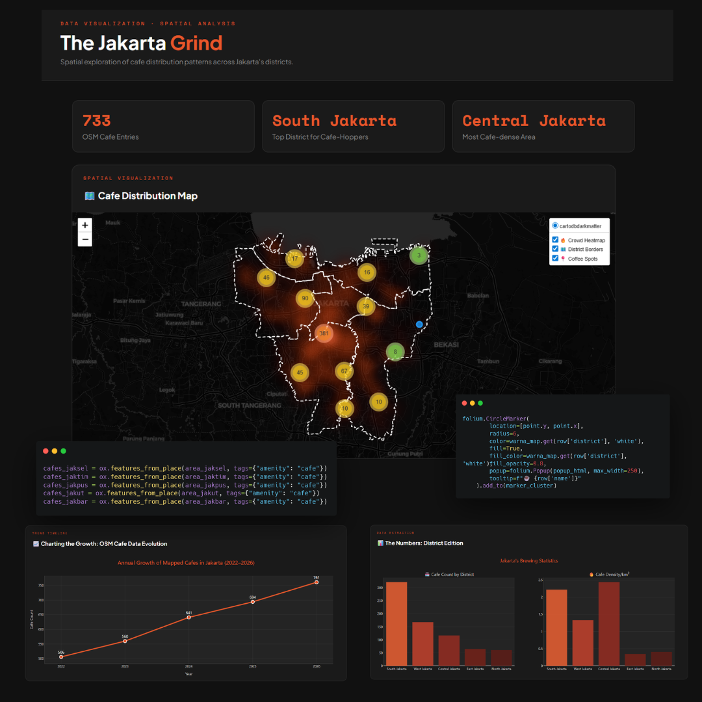

# Jakarta Cafe Distribution Map

🌐 **Live Dashboard:** <a href="https://jakarta-cafe-dashboard.vercel.app" target="_blank">jakarta-cafe-dashboard.vercel.app</a>

## Overview
Jaksel (South Jakarta) is often labelled the city's trendiest district, but do the coordinates 
back the hype? This project uses **733 OpenStreetMap cafe entries** to spatially analyse 
cafe distribution across Jakarta's 5 administrative districts and put the stereotype 
to the test.

## Study Area
Jakarta, Indonesia

## Tools & Libraries
`Python` `OSMnx` `GeoPandas` `Folium` `Plotly` `Matplotlib`

## Results
- Interactive cafe distribution map
- OSM cafe data trend timeline
- District-by-district breakdown and ranking

## Dashboard Preview

  

## Author
Aisyah Nasywa Talitha (GIS and Remote Sensing Enthusiast)

